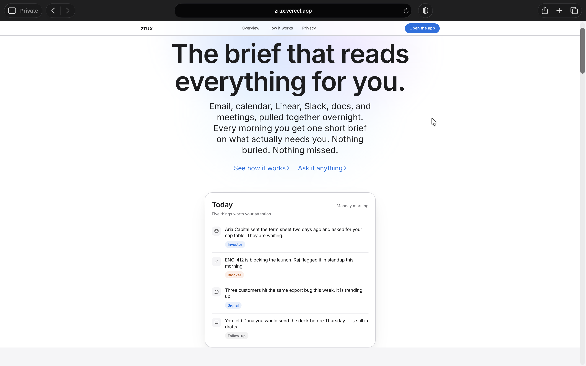
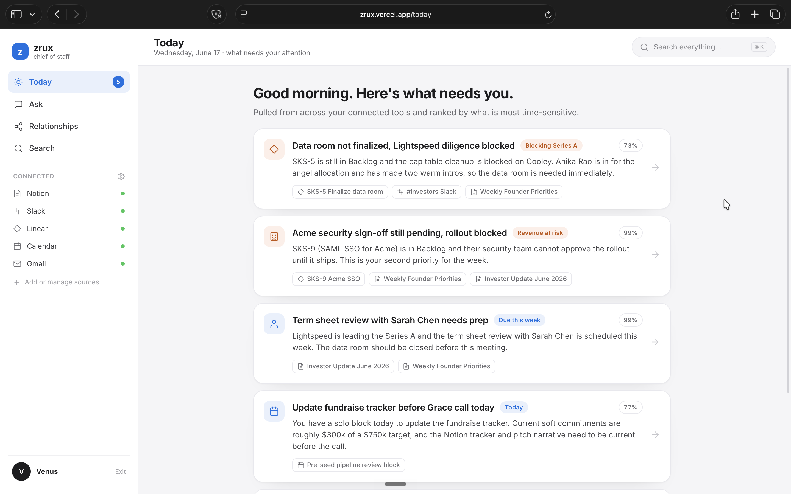
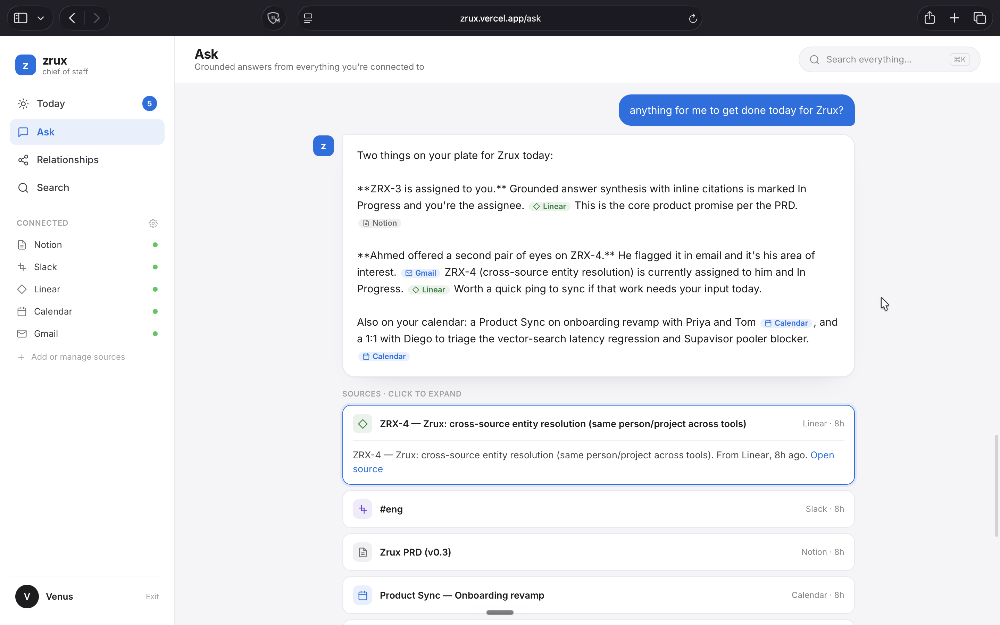
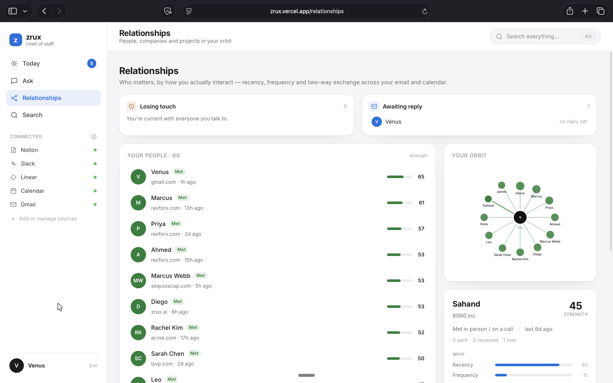
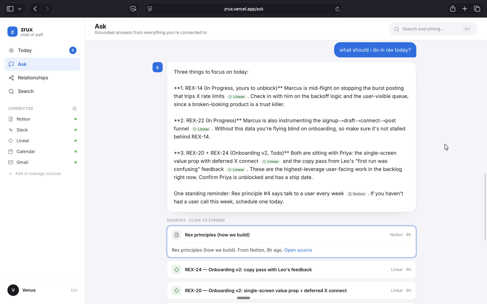
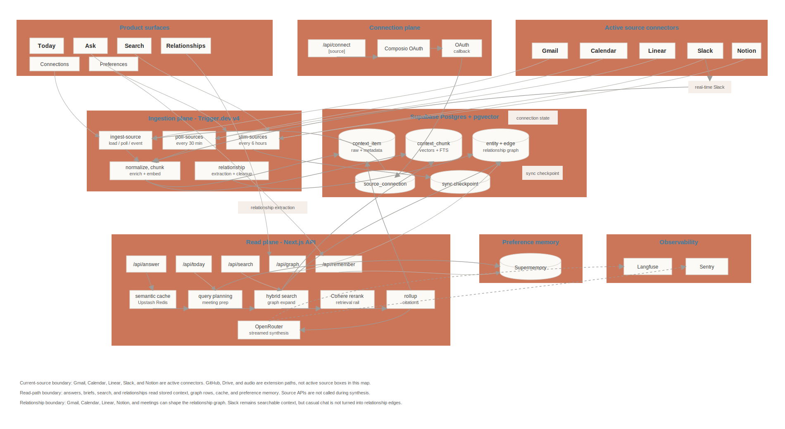
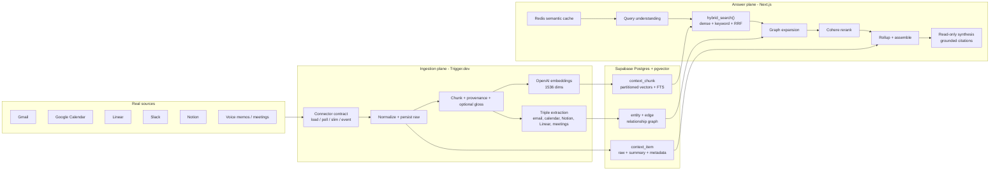

<div align="center">

# zrux

### A founder context engine that answers from what it already knows.

zrux ingests Gmail, Google Calendar, Linear, Slack, and Notion into one grounded memory layer, then answers high-leverage founder questions with citations back to the stored source context. It is not a live-API chatbot. The answer path never calls Gmail, Linear, Slack, or any other source while the founder waits.

<br />

[Architecture](#how-zrux-works) | [Quickstart](#quickstart) | [Demo Questions](#demo-questions) | [Proof](#proof-of-work) | [Setup Guide](docs/SETUP.md)

</div>

<br />

## Why It Exists

Founders do not need another chat box with a search tool bolted on. They need a system that has already read the inbox, calendar, issue tracker, docs, and team chatter, then can answer:

- What should I focus on today?
- Summarize investor activity this week.
- Which tasks are blocked right now?
- What should I know before my next meeting?
- What follow-ups am I missing?

zrux is built around a simple constraint: answers come from stored context, not live tool calls at answer time. Ingestion can be slow, durable, and retriable. Serving should be fast, synchronous, and grounded.

<br />

## Product Tour

<p>
  <strong>Landing</strong><br />
  A focused first impression: zrux is the morning brief that reads everything for you.
</p>

<p>
  
</p>

<table>
  <tr>
    <td width="50%">
      <strong>Today</strong><br />
      A ranked morning brief assembled from connected tools and ordered by what needs attention.
    </td>
    <td width="50%">
      <strong>Ask: Zrux workspace</strong><br />
      Grounded answers with inline source badges and expandable cited source cards.
    </td>
  </tr>
  <tr>
    <td></td>
    <td></td>
  </tr>
  <tr>
    <td width="50%">
      <strong>Relationships</strong><br />
      Relationship strength, reply gaps, and the founder's orbit across email and calendar.
    </td>
    <td width="50%">
      <strong>Ask: Rex workspace</strong><br />
      A second grounded answer over a different workspace, with Linear and Notion citations.
    </td>
  </tr>
  <tr>
    <td></td>
    <td></td>
  </tr>
</table>

<br />

## Demo Questions

These are the submission walkthrough questions the system is designed to answer from stored context:

```text
What should I focus on today?
Summarize investor activity this week.
Which tasks are blocked right now?
```

Good stretch questions:

```text
What should I know before my next meeting?
What follow-ups am I missing?
What customer issues are showing up repeatedly?
```

When context is missing, zrux says so. A refusal like "there is not enough investor context in your connected tools" is a correct answer, not a failure mode.

<br />

## How zrux Works

zrux is two planes over one database.

- The **ingestion plane** runs in Trigger.dev. It fetches source data through connectors, normalizes it, chunks it, enriches it, embeds it, extracts graph facts, and writes everything to Postgres.
- The **answer plane** runs in Next.js. It checks the semantic cache, plans the query, retrieves from Postgres, expands through the relationship graph, reranks, rolls up chunks to source items, and streams a cited answer.
- The planes share only Supabase Postgres. Source APIs are never called during answer synthesis.



<details>
<summary>Editable Mermaid data-flow diagram</summary>



</details>

### The Data Flow

| Stage | What happens | Why it matters |
| --- | --- | --- |
| 1. Connect | Composio handles OAuth and source fetches behind the local `Connector` contract. | OAuth velocity without letting the integration vendor own retrieval logic. |
| 2. Ingest | Trigger.dev jobs call `load`, `poll`, `slim`, and optional webhooks. | Long-running sync never happens inside a Next.js API route. |
| 3. Normalize | Every item becomes a `context_item` with `source_created_at`, `source_updated_at`, raw payload, metadata, and deletion state. | The raw episodic layer can be reprocessed without re-fetching source APIs. |
| 4. Chunk | Long content is split into `context_chunk` rows with provenance lines and optional contextual gloss. | Retrieval gets small, attributable units without losing source identity. |
| 5. Embed | Chunks use OpenAI `text-embedding-3-large` at 1536 dims. | pgvector stores dense meaning alongside Postgres full-text search. |
| 6. Extract graph | High-signal sources produce typed triples, then entity resolution canonicalizes by email first. | The assistant can answer relationship questions, not just text search questions. |
| 7. Retrieve | `hybrid_search()` runs exact KNN plus keyword search over the tenant-filtered set, then fuses by RRF and recency. | Vector recall and keyword precision reinforce each other. |
| 8. Answer | The read-only model synthesizes from assembled context and cites every claim. | Prompt injection can affect words, not actions. Thin context is refused. |

<br />

## Implementation Status

| Source | Status | Notes |
| --- | --- | --- |
| Gmail | Demo-verified real ingest | Composio OAuth, 90-day load, poll-ready connector. |
| Google Calendar | Demo-verified real ingest | Same Google consent surface as Gmail; meetings become context items. |
| Linear | Demo-verified real ingest | API-backed connector maps issues and blocked status. |
| Slack | Implemented connector | OAuth/webhook path and HMAC verification are covered by tests. |
| Notion | Implemented connector | Page fetch and markdown fallback are covered by tests. |
| GitHub | Contract-ready | Fits the same connector shape; auth env is already reserved. |
| Sentry | Contract-ready | Included in env and architecture as the error-monitoring source. |
| Voice memos / meetings | Roadmap | Deepgram key path is reserved; diarized audio is designed into the ingestion pipeline. |

<br />

## Proof of Work

This repo is intentionally built as the submission artifact, not a mock demo.

- Real data has been ingested through Gmail, Google Calendar, and Linear.
- The system correctly answered "What should I focus on today?" from stored context with citations.
- The system correctly refused "Summarize investor activity this week" when the connected tenant had no investor evidence.
- "What follow-ups am I missing?" returned grounded, cited follow-ups without inventing context.
- The current Vitest suite passes with 29 test files and 148 tests across API routes, connector mapping, ingestion normalization/chunking/enrichment, retrieval rail/rerank/rollup/assemble, semantic cache, LLM gateway failover, entity resolution, triple-extraction gating, personalization, Slack webhooks, and observability.

Key reliability behaviors are tested:

- Cache hit skips the retrieval and synthesis pipeline.
- Gateway failure degrades to cited retrieved context when possible.
- Thin context skips synthesis and returns an honest refusal.
- Slack and Sentry-style noisy sources are excluded from triple extraction gates.
- Entity resolution prefers email matches and avoids risky fuzzy merges.

<br />

## Quickstart

```bash
pnpm install
cp .env.example .env.local
pnpm exec supabase link --project-ref <your-project-ref>
pnpm exec supabase db push
pnpm db:types
pnpm dev
```

Then open [http://localhost:3000](http://localhost:3000), sign in, connect sources, ingest, and ask the demo questions.

Run the test suite:

```bash
pnpm test
```

Full credential setup lives in [docs/SETUP.md](docs/SETUP.md). `.env.example` contains names only and must never contain real secrets.

### Environment Tiers

| Tier | Variables | Unlocks |
| --- | --- | --- |
| Core spine | Supabase, `DATABASE_URL`, `OPENAI_API_KEY`, `OPENROUTER_API_KEY` | Migrations, embeddings, retrieval, answer synthesis. |
| Real ingestion | `COMPOSIO_API_KEY`, per-source Composio auth config ids, Google OAuth, Trigger.dev | Gmail, Calendar, Linear, Slack, Notion ingestion. |
| Quality and resilience | Cohere, Upstash Redis, Supermemory, Langfuse, Sentry, Deepgram | Reranking, semantic cache, circuit breaker, personalization, tracing, audio. |

<br />

## Tech Stack

| Layer | Choice |
| --- | --- |
| App | Next.js App Router, React, TypeScript |
| Package manager | pnpm |
| Database | Supabase Postgres, pgvector, RLS, hash-partitioned chunks |
| Ingestion jobs | Trigger.dev |
| Integrations | Composio plus the local connector contract |
| LLM gateway | OpenRouter through the Vercel AI SDK |
| Embeddings | OpenAI `text-embedding-3-large`, 1536 dims |
| Reranking | Cohere Rerank 3.5 |
| Cache | Upstash Redis semantic cache and circuit-breaker state |
| Personalization | Supermemory, scoped by tenant container |
| Observability | Langfuse traces plus Sentry reporting |
| Speech to text | Deepgram Nova-3 planned for diarized audio ingestion |

<br />

## Security Model

The primary security boundary is architectural: the answer-time model is read-only.

- Retrieved content is data, not instructions.
- The synthesis model has no source tools and no side-effecting tools.
- Every Supabase query is tenant-scoped by `user_id`; RLS is defense in depth.
- Webhooks use HMAC verification where event-mode ingestion is present.
- The retrieval rail drops distant chunks and caps context size before synthesis.
- API keys live in `.env.local`; the repo ships only `.env.example`.

<br />

## Design Tradeoffs Reviewers Should Know

| Tradeoff | Decision |
| --- | --- |
| Context engine vs live tool chatbot | Build the engine. Answer path reads Postgres only. |
| Composio vs Nango | Use Composio for 48-hour OAuth velocity, keep a local connector seam for a future Nango swap. |
| Exact KNN vs approximate HNSW at this scale | `hybrid_search()` does exact KNN over the filtered tenant set. HNSW is present for scale, not assumed in the core ranking path. |
| Postgres graph vs graph database | Use `entity` and `edge` tables. The founder graph is small enough for Postgres and keeps tenancy simple. |
| Supermemory vs hand-rolled profile table | Use Supermemory for Layer 3 personalization while keeping Layers 1 and 2 fully owned. |
| Raw JSONB vs object storage | Store raw source payloads in Postgres for the take-home; object storage is the production tiering lever. |

Deeper rationale lives in [docs/Architecture.md](docs/Architecture.md), [docs/spec.md](docs/spec.md), and [docs/trade-offs.md](docs/trade-offs.md).

<br />

## Repository Map

```text
app/
  api/answer/        streamed answer path
  api/connect/       source connection entrypoints
  api/webhooks/      event-mode ingestion webhooks
  (app)/             Today, Ask, Search, Relationships

lib/
  connectors/        Gmail, Calendar, Linear, Slack, Notion connector contract implementations
  ingestion/         normalize, chunk, enrich, embed, upsert
  retrieval/         plan, search, graph expand, rerank, rail, rollup, assemble, synthesize
  graph/             entity resolution and triple extraction
  cache/             Redis semantic cache
  llm/               OpenRouter gateway, retry, fallback, circuit breaker
  personalization/   Supermemory Layer 3

supabase/
  migrations/        context schema, graph schema, hybrid_search(), source state

trigger/
  ingest, poll, slim, personalization jobs

prompts/
  query understanding and answer synthesis prompts

docs/
  Architecture.md    full system design reference
  SETUP.md           local and credential setup
  trade-offs.md      implementation decisions and live verification notes
```

<br />

## Read More

- [Architecture](docs/Architecture.md): system design, data model, retrieval pipeline, prompts, resilience.
- [Setup](docs/SETUP.md): credential tiers and Supabase setup.
- [Spec](docs/spec.md): phased build plan and acceptance gates.
- [Tradeoffs](docs/trade-offs.md): implementation decisions, known risks, live verification notes.
- [Phase 6 UI Tradeoffs](docs/phase6-trade-offs.md): product and interface decisions.

<br />

## Submission Checklist

- [x] Stored-context answer path.
- [x] Real integrations for Gmail, Google Calendar, and Linear.
- [x] Connector implementations for Slack and Notion.
- [x] Relationship graph layer.
- [x] Supermemory personalization layer.
- [x] Semantic cache, fallback, and graceful degradation paths.
- [x] `.env.example` with variable names only.
- [x] README with setup, architecture, source status, and demo questions.
- [ ] Hosted URL and Traces link added before final submission.
