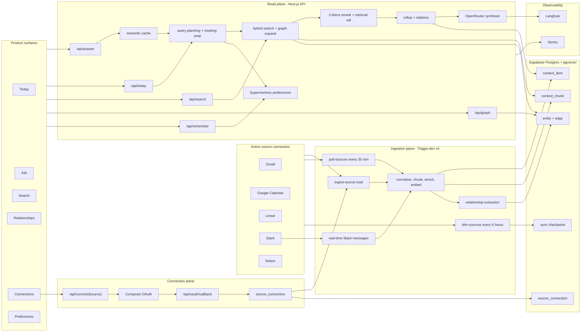

<div align="center">

# zrux

### The founder brief that reads your work tools before you do.

zrux connects to your email, calendar, issues, docs, and team chat, then turns that scattered context into a focused daily brief, grounded answers, relationship intelligence, and cross-source search.

<br />

[How it works](#how-zrux-works) | [Connectors](#connects-to) | [Run locally](#run-locally)

</div>

<br />

## What zrux Does

Founders spend the day switching between inboxes, calendars, issue trackers, docs, and chat threads. zrux pulls those signals into one context engine, then gives you a ranked daily brief, grounded answers with citations, cross-source search, relationship intelligence, and preference-aware prioritization. The product rule is simple: source APIs are used during ingestion, while answers are written from stored context.

<br />

## Product Tour

<p>
  <strong>Landing</strong><br />
  A simple promise: one short brief on what actually needs you.
</p>

<p>
  
</p>

<table>
  <tr>
    <td width="50%">
      <strong>Today</strong><br />
      A ranked morning brief assembled from connected tools and ordered by urgency and preference.
    </td>
    <td width="50%">
      <strong>Ask</strong><br />
      Grounded answers with inline source badges and expandable cited source cards.
    </td>
  </tr>
  <tr>
    <td></td>
    <td></td>
  </tr>
  <tr>
    <td width="50%">
      <strong>Relationships</strong><br />
      Strength-ranked contacts, reply gaps, and a you-centered relationship orbit.
    </td>
    <td width="50%">
      <strong>Ask in another workspace</strong><br />
      The same read path works across a different connected workspace with Linear and Notion citations.
    </td>
  </tr>
  <tr>
    <td></td>
    <td></td>
  </tr>
</table>

<br />

## Questions It Answers

```text
What should I focus on Today?
Anything from Zrux that needs my attention?
What blockers are we facing, if any?
```

When the connected tools do not contain enough evidence, zrux says that plainly instead of inventing an answer.

### Sample Outputs

```text
Q: What should I focus on Today?

Focus on the data-room blocker first. The Linear item for finalizing diligence
materials is still open, the weekly priorities doc calls it out as urgent, and
the investor thread is waiting on that package before the next conversation.
[Linear, Notion, Gmail]

Second, prep for the Sarah Chen term-sheet review. Calendar has the review this
week, and the latest investor update says the data room should be closed before
that meeting. [Calendar, Notion]
```

```text
Q: Anything from Zrux that needs my attention?

Two Zrux items need attention. ZRX-3 is assigned to you and still in progress:
grounded answer synthesis with inline citations. ZRX-4 is active too, but Ahmed
offered to help with cross-source entity resolution, so the next step is a quick
sync with him. [Linear, Gmail, Notion]
```

```text
Q: What blockers are we facing, if any?

The main blocker is Acme security sign-off. The SAML SSO issue is still in
backlog, and the rollout cannot move until Acme's security team approves it.
There is also a data-room blocker for the Series A process: the cap table cleanup
is waiting on Cooley, and the diligence package is not finalized yet.
[Linear, Gmail, Notion]
```

<br />

## How zrux Works

zrux has three core loops:

- **Connection loop:** Next.js starts Composio OAuth for each source, stores connection state in Postgres, and queues the first load.
- **Ingestion loop:** Trigger.dev jobs load, poll, and slim connected sources, normalize items, embed chunks, extract high-signal relationships, and keep source state current.
- **Read loop:** API routes retrieve from stored context, enrich with graph and preference memory, rerank, assemble citations, and synthesize grounded answers.


<details>
<summary>Editable Mermaid data-flow diagram</summary>



</details>

<br />

## Connects To

| Source          | What zrux uses it for                                                            |
| --------------- | -------------------------------------------------------------------------------- |
| Gmail           | Email threads, senders, follow-ups, and relationship signals.                    |
| Google Calendar | Meetings, participants, meeting-prep context, and relationship recency.          |
| Linear          | Issues, ownership, blockers, status, and project work.                           |
| Slack           | Channel messages through load/poll/slim plus near-real-time webhook events.      |
| Notion          | Pages and docs through markdown ingestion, chunking, and graph-eligible context. |

The connector contract is shared across sources: `load`, `poll`, `slim`, and optional `handleEvent`. GitHub, audio ingestion, and additional tools can be added through that same seam. Sentry is used for application observability in the current product.

<br />

## Product Surfaces

| Surface       | What it does                                                                                       |
| ------------- | -------------------------------------------------------------------------------------------------- |
| Today         | Generates a cached daily brief from the same retrieval pipeline used by Ask.                       |
| Ask           | Streams grounded answers with citations, source cards, semantic cache hits, and graceful fallback. |
| Search        | Runs hybrid keyword plus semantic search across active connected sources.                          |
| Relationships | Builds strength-ranked contact surfaces from email and calendar interaction metadata.              |
| Connections   | Starts, reconciles, and disconnects source connections.                                            |
| Preferences   | Stores standing priorities that shape answer ordering without adding facts.                        |

<br />

## Run Locally

```bash
git clone https://github.com/venusbhatia/zrux.git
cd zrux
cp .env.example .env.local
# Fill .env.local with your Supabase, Composio, OpenRouter, OpenAI, and Trigger.dev values.
pnpm install
pnpm exec supabase link --project-ref <your-project-ref>
pnpm exec supabase db push
pnpm db:types
pnpm dev
```

Open [http://localhost:3000](http://localhost:3000) for local development.

The full credential guide is in [docs/SETUP.md](docs/SETUP.md). `.env.example` lists the required variable names without real secrets.

<br />

## Tradeoffs and Future Improvements

The biggest tradeoff is speed versus ownership. zrux leans on managed services where they remove a lot of early product drag: Composio for OAuth and source access, and Supermemory for the personalization layer. The important part is that both sit behind small seams. Sources go through the local connector contract, and personalization is isolated behind one module, so swapping Composio for Nango or Supermemory for a first-party profile table would be a contained change rather than a rewrite.

The next improvements are about owning more of the rented pieces and making the product feel closer to the founder's daily flow. I would add the sources already designed for the connector model, especially GitHub and Google Drive. I would tune the ranking constants against real query logs instead of hand-tuning them upfront. And I would push the interaction surface beyond the web app: Telegram or iMessage should let a founder send one quick question and get the same grounded answer back where they already are.

<br />

## Stack

| Layer           | Choice                                     |
| --------------- | ------------------------------------------ |
| App             | Next.js App Router, React, TypeScript      |
| Database        | Supabase Postgres, pgvector, RLS           |
| Ingestion       | Trigger.dev v4                             |
| Integrations    | Composio plus the local connector contract |
| LLM             | OpenRouter through the Vercel AI SDK       |
| Embeddings      | OpenAI `text-embedding-3-large`, 1536 dims |
| Reranking       | Cohere Rerank                              |
| Cache           | Upstash Redis semantic cache               |
| Personalization | Supermemory                                |
| Observability   | Langfuse traces and Sentry reporting       |

<br />

## Repository Map

```text
app/
  api/answer/        streamed answer path
  api/connect/       source connection management
  api/webhooks/      event-mode ingestion webhooks
  (app)/             Today, Ask, Search, Relationships

lib/
  connectors/        Gmail, Calendar, Linear, Slack, Notion
  ingestion/         normalize, chunk, enrich, embed, upsert
  retrieval/         plan, meeting prep, search, graph expand, rerank, rail, rollup, assemble
  graph/             entity resolution, relationship extraction, relationship intelligence
  cache/             Redis semantic cache
  llm/               OpenRouter gateway, retry, fallback, circuit breaker
  personalization/   Supermemory preferences

supabase/
  migrations/        context, graph, source state, hybrid search

trigger/
  ingest, poll, slim, personalization jobs
```
