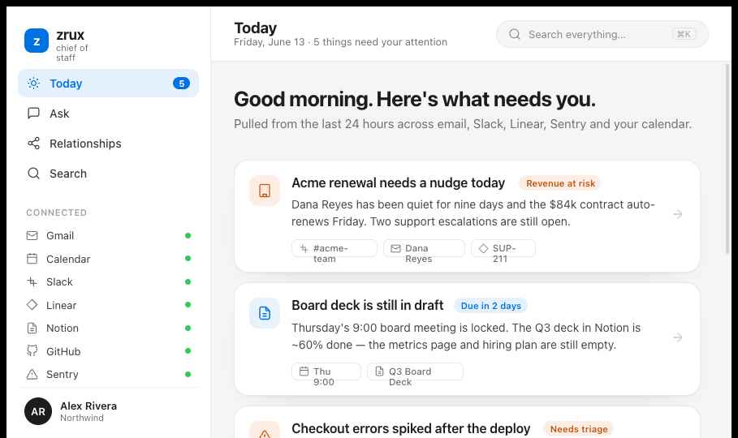
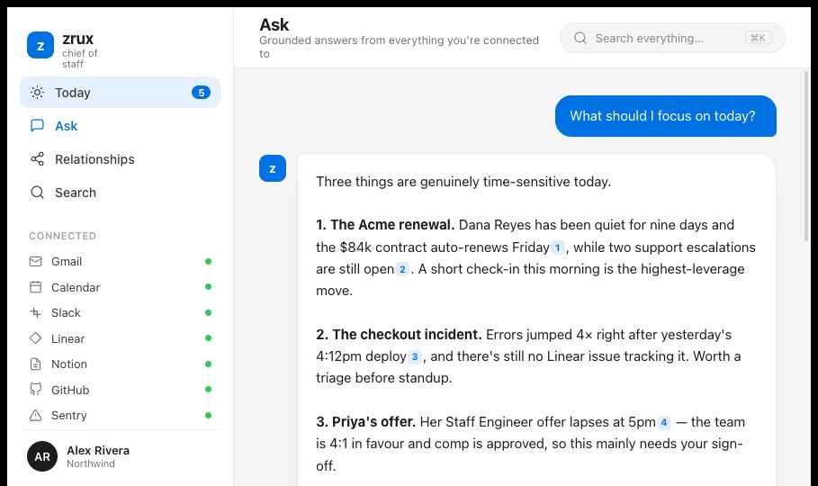
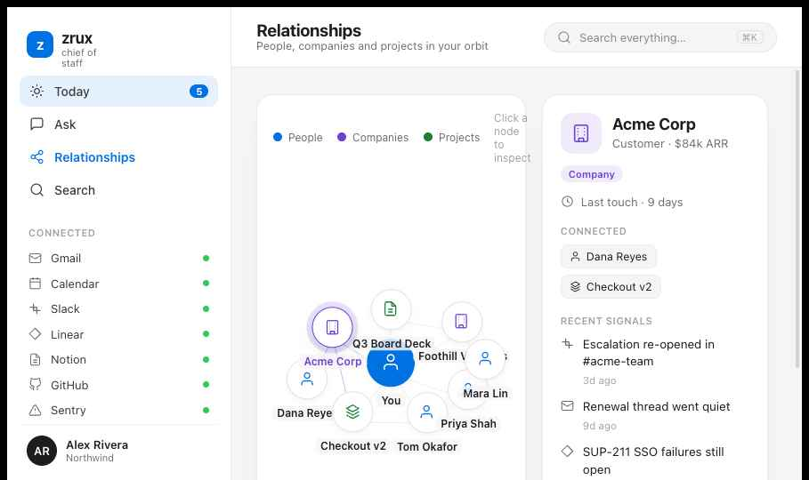
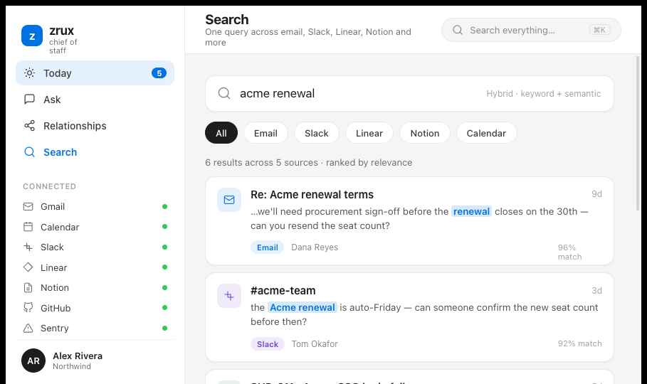
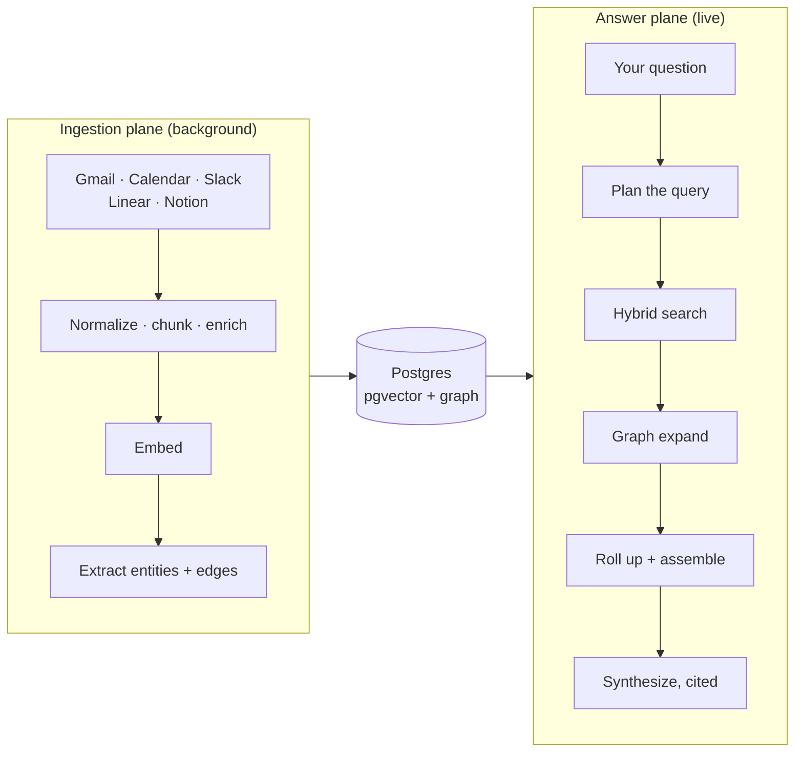

<div align="center">

# zrux

### The chief of staff that already read everything.

zrux connects to your inbox, calendar, Slack, Linear, and Notion, then answers real questions about your work. Every answer is grounded in your own data and cited back to the source it came from. No guessing, no made-up context.

</div>



<br />

## Ask it anything

You talk to zrux the way you'd brief a sharp new hire who somehow already knows your whole company. Ask a question, get a straight answer, and click any number to see exactly where it came from.



```
You   What should I focus on today?

zrux  Three things are genuinely time-sensitive today.

      1. The Acme renewal. Dana Reyes has been quiet for nine days and
         the $84k contract auto-renews Friday [1], while two support
         escalations are still open [2]. A short check-in this morning
         is the highest-leverage move.

      2. The checkout incident. Errors jumped 4x right after yesterday's
         4:12pm deploy [3], and there's still no Linear issue tracking it.

      3. Priya's offer. Her Staff Engineer offer lapses at 5pm [4]. The
         team is 4:1 in favour and comp is approved, so this just needs
         your sign-off.

      [1] Gmail, Re: Acme renewal terms, 9d ago
      [2] Sentry, SUP-211 SSO failures, 5d ago
      [3] Sentry, Checkout error spike, 1d ago
      [4] Linear, OFFER-12 Priya Shah, 2d ago
```

If the context isn't there, zrux says so instead of inventing one. Thin evidence gets an honest "not enough in your connected tools" rather than a confident hallucination.

**Questions it's good at:**

- What should I focus on today?
- Summarize investor activity this week.
- Which tasks are blocked right now?
- What should I know before my next meeting?
- What follow-ups am I missing?
- What customer issues keep coming up?

<br />

## See your world

**Relationships.** The people, companies, and projects in your orbit, wired together from what actually happened across your tools. Tap any node to see the recent signals around it.



**Search.** One query across email, Slack, Linear, Notion, and Calendar at once. Keyword precision and semantic recall in the same ranked list, with a match score on every hit.



<br />

## How it works

zrux is a context engine, not a chatbot that calls APIs while you wait. It runs as two planes that share only a database.

The **ingestion plane** reads your sources on a schedule, normalizes everything into one shape, embeds it, and writes it to Postgres. The **answer plane** never touches a source API. It reads what's already stored, retrieves the right slice, and asks an LLM to write a grounded, cited answer. Ingestion is slow and in the background. Answering is fast and synchronous.



Three things make the answers good:

**Hybrid retrieval.** Every query runs dense vector search and keyword search together, fused by Reciprocal Rank Fusion and nudged by how recent things are. Vector search alone misses exact terms. Keyword search alone misses meaning. Doing both and fusing them beats either one.

**A real relationship graph.** As data comes in, zrux pulls out typed entities (people, companies, projects) and the relationships between them, resolving "Sarah", "Sarah Chen", and "sarah@acme.com" into one node. At answer time it expands from the people and companies in your question to pull in connected context you didn't think to ask for.

**Grounded and safe by design.** The model that writes your answer holds zero side-effecting tools. It can read context and produce text, nothing else. So even a hostile email that tries to hijack the assistant can only change words on a screen, never take an action. Retrieved content is treated as data, never as instructions.

<br />

## What it connects to

| Source                 | Via                       | Status        |
| ---------------------- | ------------------------- | ------------- |
| Gmail                  | Composio OAuth            | Live          |
| Google Calendar        | Composio OAuth            | Live          |
| Linear                 | API token                 | Live          |
| Slack                  | OAuth + webhooks          | Live          |
| Notion                 | OAuth                     | Live          |
| GitHub / Sentry        | same `Connector` contract | Ready to wire |
| Voice memos + meetings | Deepgram Nova-3, diarized | Roadmap       |

Every source implements the same `Connector` interface (`load`, `poll`, `slim`), so adding the next one is one file, not a rewrite.

<br />

## Built with

|                 |                                                  |
| --------------- | ------------------------------------------------ |
| App             | Next.js (App Router) + TypeScript                |
| Database        | Supabase: Postgres + pgvector                    |
| LLM             | OpenRouter (Claude Sonnet) via the Vercel AI SDK |
| Embeddings      | OpenAI `text-embedding-3-large`                  |
| Integrations    | Composio managed OAuth                           |
| Background jobs | Trigger.dev                                      |
| Personalization | Supermemory                                      |
| Tracing         | Langfuse                                         |

<br />

## Run it yourself

```bash
pnpm install
cp .env.example .env.local        # fill in your keys
pnpm exec supabase db push        # apply the schema
pnpm db:types                     # generate typed client
pnpm dev
```

Keys are grouped by what they turn on, so you can stand up the core before wiring every source. Full list and where to get each one lives in [`docs/SETUP.md`](docs/SETUP.md); names only (no values) are in [`.env.example`](.env.example).

- **Tier 1, the spine:** Supabase, `OPENAI_API_KEY`, `OPENROUTER_API_KEY`. Enough to migrate the schema and answer questions.
- **Tier 2, real data:** `COMPOSIO_API_KEY`, Google OAuth for sign-in, `TRIGGER_*` for ingestion.
- **Tier 3, quality:** Cohere, Upstash, Deepgram, Supermemory, Langfuse.

```bash
pnpm test     # 104 tests across connectors, ingestion, retrieval, and the graph
```

<br />

## Tradeoffs and what's next

Real integrations only, no mock data. The answers come from whatever you actually connect.

Retrieval uses exact nearest-neighbor search over each tenant's own data, which is more accurate than an approximate index at this scale. HNSW is there for when a single tenant crosses millions of vectors. The resilience layer (semantic cache, circuit breaker with model fallback, and a Cohere reranker) is partly in place and partly on the roadmap. Audio ingestion, a proactive morning briefing over Telegram, and a richer eval harness are the next things on deck.

The deeper design notes, schema, and the reasoning behind each decision live in [`docs/Architecture.md`](docs/Architecture.md) and [`docs/trade-offs.md`](docs/trade-offs.md).

<br />

## Where things live

```
app/        Next.js routes. api/answer streams the cited answer.
lib/
  connectors/   one file per source, all implement Connector
  ingestion/    normalize, chunk, enrich, embed
  retrieval/    plan, search, graph-expand, rollup, assemble, synthesize
  graph/        entity resolution + triple extraction (Layer 2)
  llm/          OpenRouter gateway
supabase/   numbered SQL migrations, including hybrid_search()
trigger/    background ingestion jobs
prompts/    the query-understanding and synthesis prompts
```
